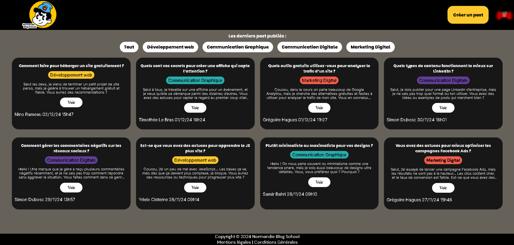

# Normandie Blog School

Dans le cadre d'un projet scolaire, nous avons développé en groupe de 6 un site communautaire appelé **Normandie Blog School**. Ce site vise à favoriser l'entraide entre étudiants des quatre spécialités proposées dans notre école.

Voici le lien vers le projet : [Normandie Blog School](https://nino-rameau.github.io/normandie-blog-school/index.html)

## Sommaire

- [Aperçu](#aperçu)
- [Fonctionnalités](#fonctionnalités)
- [Technologies Utilisées](#technologies-utilisées)
- [Licence](#licence)

## Aperçu

  

## Fonctionnalités

- **Responsive** : Le site s'adapte aux différents formats d'écran.
- **Création de posts** _(bientôt disponible)_ : Une fonctionnalité permettant de créer des posts via un formulaire sera ajoutée prochainement. Les autres étudiants pourront y répondre, et toutes les données seront enregistrées dans une base de données.

## Technologies Utilisées

- HTML
- CSS
- JavaScript
- PHP _(prévu pour mai 2025)_
- SQL _(prévu pour mai 2025)_

## Licence

Ce projet a été réalisé en groupe dans le cadre d'un projet scolaire en décembre 2024. Il sera poursuivi en mai 2025.
